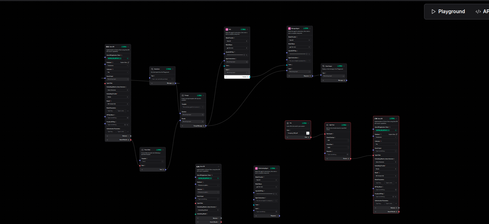
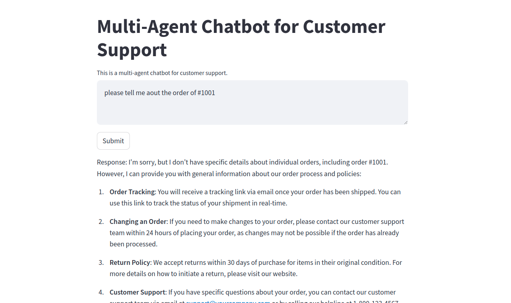

# MultiAgent-CareSupport
MultiAgent-CareSupport
## project overview
MultiAgent-CareSupport is a multi-agent system that provides care support for the customer regarding
their queries. The system is designed to provide the best possible solution to the customer queries and lookup the 
orders and products in the database. The system is designed to provide the best possible solution to the customer queries and lookup the
## Deshboard UI



## Technologies Used
- streamlit
- python
- langflow
- AstraDB
- VectorStore
- Rag
- openai
- fastapi

## Installation
```bash
pip install -r requirements.txt
```
## Usage
```bash
  streamlit run main.py
```
